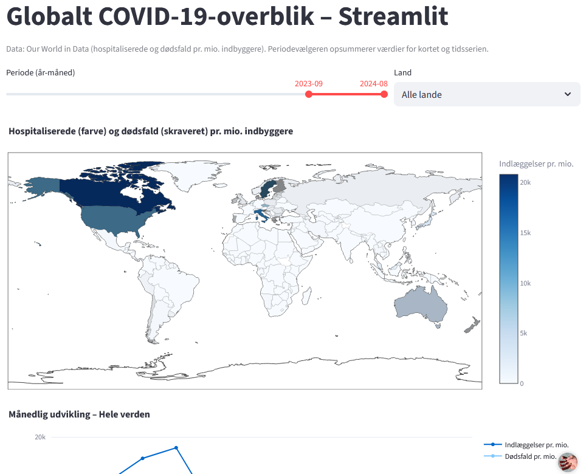
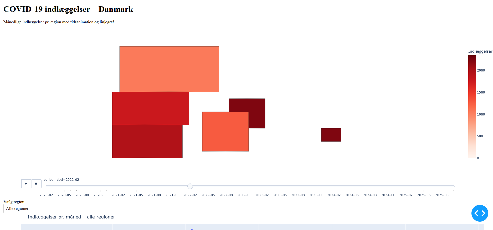
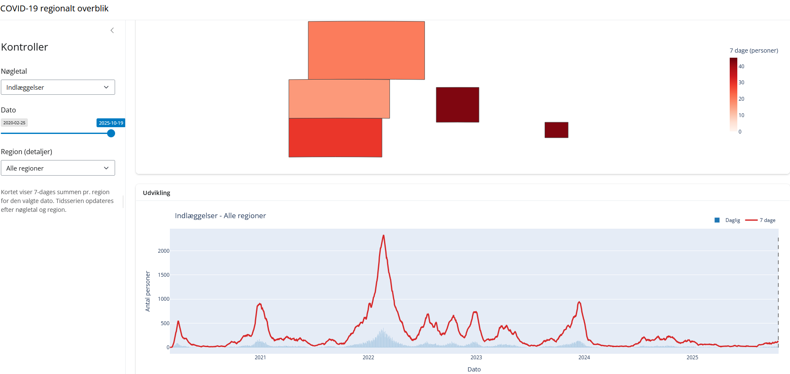
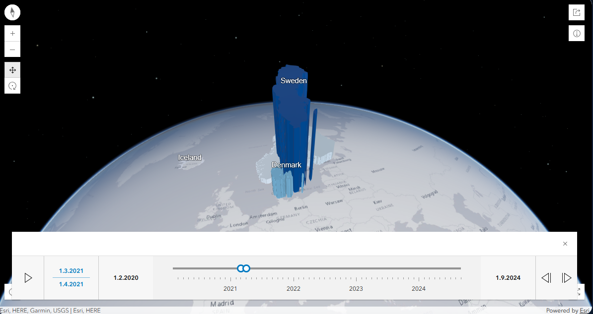
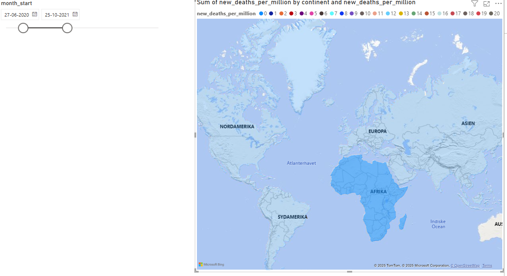

# Vibe coding og AI-assisteret udvikling af geodata-dashboards

## Slide 1 - Velkommen
- AI + data => dashboards på rekordtid

## Slide 2 - Hvem er på scenen?
- Hvordan arbejder vi med [AI](https://en.wikipedia.org/wiki/Generative_artificial_intelligence) og hvad/hvem er [SSI](https://ssi.dk)?
    * SSI er under Indenrigs- og Sundhedsministeriet. SSI forebygger og bekæmper infektionssygdomme og medfødte sygdomme. 
    * har nedskrevne retninglinjer for brug og muligheder for at søge om at benytte AI på nye måder eller nye sammenhænge
    * [bruger AI seriøst](https://www.ssi.dk/aktuelt/nyheder/2024/millionstoette-til-ai-drevet-forskning-i-blodforgiftning)
    * har en godkendt AI-prompt
- Hvem er [Steen Hulthin Rasmussen](https://www.linkedin.com/in/steenhulthin/) 
    * 
    * er datadomptør/udvikler/kaffedrikker
    * arbejder til daglig med datapipelines og udvikling af dashboards
    * synes AI er lige dele fremtiden, et fantastisk værktøj, skræmmende, fascinerende og kildekritikfremkaldende

## Slide 3 - Vibe coding vs. AI-assisteret udvikling
- Hvad er “vibe coding” og kan AI hjælpe med kode?
    - [Vibe coding](https://en.wikipedia.org/wiki/Vibe_coding) er et ret nyt udtryk (2025), som blev "opfundet" af en co-founder af OpenAI (som står for chatgpt) 
    - konceptet er at AI (sprogmodellen) skriver koden og du som udvikler ikke nødvendigvis forstår alt (eller noget overhovedet) af koden. 
    - Vibe coding: AI som makker i [IDE](https://en.wikipedia.org/wiki/Integrated_development_environment)’et (autofuldførelse, chat, kodeforslag)
    - AI-assisteret udvikling: manuel prompt-workflow udenfor IDE’et (den almindelige prompt)
    - Samme grundidé, men forskellige tilgange

## Slide 4 - Mission briefing (mål, data, værktøjer, tidsramme)
- Mission briefing
    - **Mål:** bygge dashboards hurtigt og spare Kortdage-deltagerne for faldgruberne
    - **Data:** COVID-19 tal på globalt, EU-, nordisk og dansk niveau
        - globalt: Our world in data - TODO: tilføj link og evt. credits
        - EU: ECDC - TODO: tilføj link og evt. credits
        - Dansk: SSI - TODO: tilføj link og evt. credits
    - **Værktøjer:** Streamlit, Shiny, Dash, ArcGIS (API + Dashboards/Viewer), Power BI
    - **Tidsramme:** 5 fredage (som var lige i underkanten) → 20 minutters præsentation

## Slide 5 - Ambitionen (aka "det var ret ambitiøst...")
- Ambitionen (eller "det var ret ambitiøst...")
    - 3 datasæt, fem platforme
    - 3 Python-teknologier + ArcGIS dashboard + Power BI dashboard
    - Lær, forstå og videreformidl
    - Lad alt materiale være tilgængelig
    - Kom så langt som muligt
    - Hav det sjovt

## Slide 6 - Første aha-oplevelse
- Første aha-oplevelse (Optimisme -> realisme)
    - Steen: "Lad AI lave en PowerPoint-præsentation i SSI skabelonen..."
    - 2 timer og mange forsøg senere: "Nå, måske er AI bedre til at skrive kode and PowerPoint..."

 | 

## Slide X - Hvordan ser AI-assiteret udvikling ud?
- Hvordan ser AI-assiteret udvikling ud?
TODO: indsæt film/GIS af prompt og returfiler

## Slide X - Hvordan ser vibe coding ud? 
TODO: indsæt film/GIS af prompt og ændringer i IDE

## Slide X - Streamlit
- **Streamlit:** prompts → global prototype; link til streamlit.app
    - Prompt: "Lad os lave dashboards. Lad os starte med Streamlit. Streamlit skal være med OWID data. Der skal øverst være et kort over verden. Landene skal være farvet efter indlæggelser per capita og skraveret efter dødsfald per capita (hvis det er muligt). Der skal være en periodevælger, hvor der kan vælges år og måned. Tallene skal summeres over den valgte periode. Det skal være muligt at vælge et specifikt land. Under kortet skal der være en graf der viser indlæggelser og død per capita over tid (summeret på månedsniveau) for det valgte land (og ellers for hele verden)."
    - AI kommer med en plan
    - Prompt: "Make it so!" 
    - efter lidt fejlrettelse - og pasting af fejlkoder er dashboardet klar
    - screenshot: 

## Slide X - Dash
- **Dash:** geojson-dansefest, simplificering og prompts der fejlede (og blev reddet)
    - Prompt: "Jeg vil gerne have en app med et kort over Danmark inddelt i regioner. Kortet skal vise et timelapse over indlæggelser over tid baseret på det danske data. Tænker du Dash eller shiny til den opgave?"
    - Meget bøvl med geojson. Læring: giv AI det data, der skal benyttes, så formatet er korrekt. AI er god til at generere data også, men det er nok ikke i det skema du ønsker.
    - screenshot: 

## Slide X - Shiny
- **Shiny:** sidebar/timelapse; Shinylive-export som backup; hosting-status
    - promtede AI til at give forslag til at foreslå en visualisering på baggrund af data. 
    - Resultatet blev meget lig Dash dashboardet
    - https://steenhulthin.shinyapps.io/covid-19-regionalt-overblik/
    - screenshot: 

## Slide X - ArcGIS
- **ArcGIS 3D scene:** propy-workflow, Living Atlas, timeslider og 3D
    - Promptede generering af en 3D scene. Data generering fungerede rimeligt (med et par hickups)
    - Svært at lave udviklingen med vibe coding - der er brug for at klikke rundt i ArcGIS online
    - Resultatet blev ganske godt, men AI "forstår" ikke helt, hvad der skal til for at få tingene til at fungere i ArcGIS online
    - screenshot: 

## Slide X - Power BI
- **Power BI:** AI-assistance vs. enterprise-friktion (licenser, hosting, maps)
    - Meget friktion
    - AI har det svært med brugerflader - specielt når de ændrer sig meget over tid/versioner
    - Jeg opgav at lave et funktionelt dashboard med AI. Vibe codning var ikke mulig og prompt svar var upræcise og ikke mulige at følge i PowerBI brugerfladen 
    - screenshot: 

## Slide X - Vurdering af de forskellige teknologier
- Hvordan er teknologierne i forhold til at udvikling med AI
    TODO: indsæt pros_cons.md tabel

## Slide 9 - Hvad er AI særligt velegnet til?
- Hvad er AI særligt velegnet til?
    - Lyn-prototyper og idéafprøvning
    - Review/korrektur og dokumentation
    - Teknologier med stor community-hjælp
    - Workflows der kan scriptes eller automatiseres

## Slide 10 - Tips til at bruge AI effektivt
- Tips til at bruge AI effektivt
    - Når du vibe coder og får en fejl: prompt AI med fejlen og kontekst (log, hvad du forventer og hvad du rent faktisk fik) og bed den rette fejlen
    - Giv noget kontekst – så får du bedre svar
    - Bed AI’en stille dig spørgsmål før den forelår løsningen
    - Bed om flere mulige løsninger med for og imod
    - Log dine prompts (prompts.md) og gem hits som skabeloner
    - Hav noget arbejde du kan laves mens AI'en "tænker". Nogle opgaver tager lang tid.

## Slide 11 - Overvejelser og sikkerhed
- Overvejelser og sikkerhed
    - Må du bruge AI på arbejdet? Hvad siger politikkerne?
    - Vibe coding vs. AI-assisteret udvikling ift. compliance og logging
    - Datafølsomhed 
        * Mit råd: brug aldrig persondata - brug kunstig eller offentlig tilgængeligt data
        * Hvis der er brug for rigtig data, så gør det manuelt, når løsningen skal i drift
    TODO: eksempel på vibe coding
    TODO: eksempel på AI-assisteret

## Slide 12 - Læring og takeaways
- Læring og takeaways
    - Hvis du ved, hvad du skal gøre og det ikke tager lang tid, så gør det selv
    - Hvor gav AI størst værdi, og hvornår var det spild af tid?
    - Konkrete råd til at prøve vibe coding på dit eget dashboard
        - lav en agents.md (eller find en på nettet eller få hjælp af AI til at lave den)
        - vælg en teknologi, der bliver brugt af mange
        - vælg metode/teknologi som du selv forstår (ikke et must, men det gør alting nemmere)
    - AI gør os ikke (nødvendigvis) dummere, hvis du forstår, hvad laver kan du virkelig lære mange nye ting

## Slide 13 - Afslutning
- AI er magisk makker, når man bruger den rigtigt
- Q&A og tak for I kom!
- Link til "alt": 
    * https://github.com/steenhulthin/vibe-coding-kortdage-2025 
    * https://steenhulthin.github.io/vibe-coding-kortdage-2025/ 
